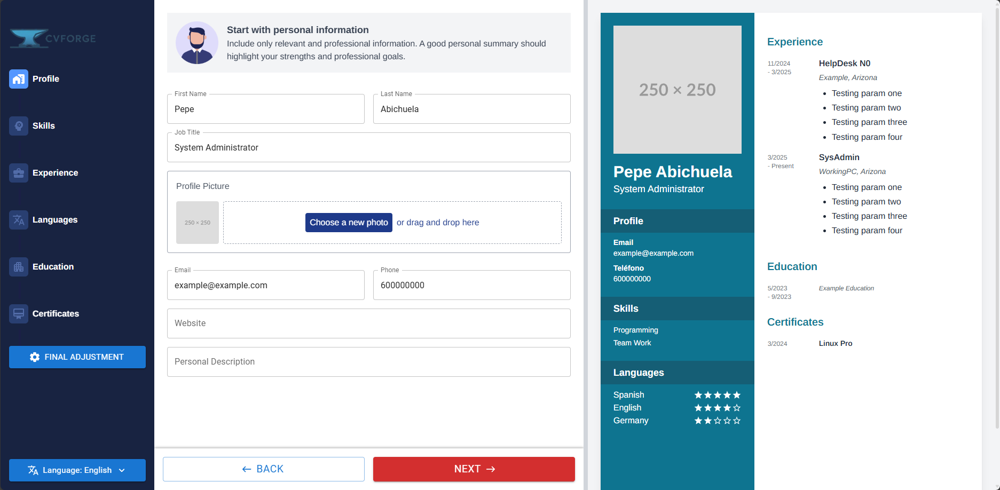

<p align="center">
    
</p>
<p align="center"><h1 align="center">CV-FORGE</h1></p>
<p align="center">
	<em><code>❯ Create professional, customizable CVs with ease</code></em>
</p>
<p align="center">
	
	
	
	
</p>
<br>

## 🔗 Table of Contents

- [📍 Overview](#-overview)
- [👾 Features](#-features)
- [🚀 Getting Started](#-getting-started)
  - [☑️ Prerequisites](#-prerequisites)
  - [⚙️ Installation](#-installation)
  - [🤖 Usage](#🤖-usage)
  - [🧪 Testing](#🧪-testing)
- [🔰 Contributing](#-contributing)
- [🎗 License](#-license)
- [🙌 Acknowledgments](#-acknowledgments)

---

## 📍 Overview

CV-Forge is a modern, React-based application for creating professional CVs with a user-friendly interface. The application features a step-by-step form process and real-time preview, allowing users to craft beautiful, customized CVs that can be exported as PDF documents or saved as JSON for future editing.

<p align="center">
    
</p>

---

## 👾 Features

- **Multi-step Form Process**: Navigate through different sections of your CV with an intuitive stepper interface
- **Real-time Preview**: See changes to your CV in real-time as you edit
- **Comprehensive CV Sections**:
  - Personal Information & Profile
  - Skills
  - Work Experience
  - Languages
  - Education
  - Certificates
- **Export Options**:
  - Export to PDF for sharing and printing
  - Save/Load CV data as JSON for future editing
- **Internationalization**: Multilingual support with i18next
- **Modern UI**: Built with Material UI and Tailwind CSS for a clean, responsive interface
- **Rich Text Editing**: TipTap editor for formatting text in descriptions

---
## 🚀 Getting Started

### ☑️ Prerequisites

Before getting started with CV-Forge, ensure your runtime environment meets the following requirements:

- **Node.js**: v16 or higher
- **Package Manager**: npm or yarn


### ⚙️ Installation

Install CV-Forge using one of the following methods:

**Build from source:**

1. Clone the CV-Forge repository:
```sh
❯ git clone https://github.com/Joansitoh/cv-forge
```

2. Navigate to the project directory:
```sh
❯ cd cv-forge
```

3. Install the project dependencies:


**Using `npm`** &nbsp; [](https://www.npmjs.com/)

```sh
❯ npm install
```


### 🤖 Usage
Run CV-Forge using the following command:
**Using `npm`** &nbsp; [](https://www.npmjs.com/)

```sh
❯ npm run dev
```

This will start the development server, and you can access the application at http://localhost:5173 (or the port specified by Vite).

### 🧪 Testing
Run the test suite using the following command:
**Using `npm`** &nbsp; [](https://www.npmjs.com/)

```sh
❯ npm test
```


---

## 🔰 Contributing

- **💬 [Join the Discussions](https://github.com/Joansitoh/cv-forge/discussions)**: Share your insights, provide feedback, or ask questions.
- **🐛 [Report Issues](https://github.com/Joansitoh/cv-forge/issues)**: Submit bugs found or log feature requests for the `cv-forge` project.
- **💡 [Submit Pull Requests](https://github.com/Joansitoh/cv-forge/blob/main/CONTRIBUTING.md)**: Review open PRs, and submit your own PRs.

<details closed>
<summary>Contributing Guidelines</summary>

1. **Fork the Repository**: Start by forking the project repository to your github account.
2. **Clone Locally**: Clone the forked repository to your local machine using a git client.
   ```sh
   git clone https://github.com/Joansitoh/cv-forge
   ```
3. **Create a New Branch**: Always work on a new branch, giving it a descriptive name.
   ```sh
   git checkout -b new-feature-x
   ```
4. **Make Your Changes**: Develop and test your changes locally.
5. **Commit Your Changes**: Commit with a clear message describing your updates.
   ```sh
   git commit -m 'Implemented new feature x.'
   ```
6. **Push to github**: Push the changes to your forked repository.
   ```sh
   git push origin new-feature-x
   ```
7. **Submit a Pull Request**: Create a PR against the original project repository. Clearly describe the changes and their motivations.
8. **Review**: Once your PR is reviewed and approved, it will be merged into the main branch. Congratulations on your contribution!
</details>

<details closed>
<summary>Contributor Graph</summary>
<br>
<p align="left">
   <a href="https://github.com{/Joansitoh/cv-forge/}graphs/contributors">
      
   </a>
</p>
</details>

---

## 🎗 License

This project is protected under the [MIT](https://choosealicense.com/licenses/mit/) License. For more details, refer to the [LICENSE](https://choosealicense.com/licenses/mit/) file.

---

## 🙌 Acknowledgments

- Material UI for the beautiful component library
- TailwindCSS for the utility-first CSS framework
- React PDF for PDF generation capabilities
- i18next for internationalization support
- All contributors who have helped shape and improve this project

---